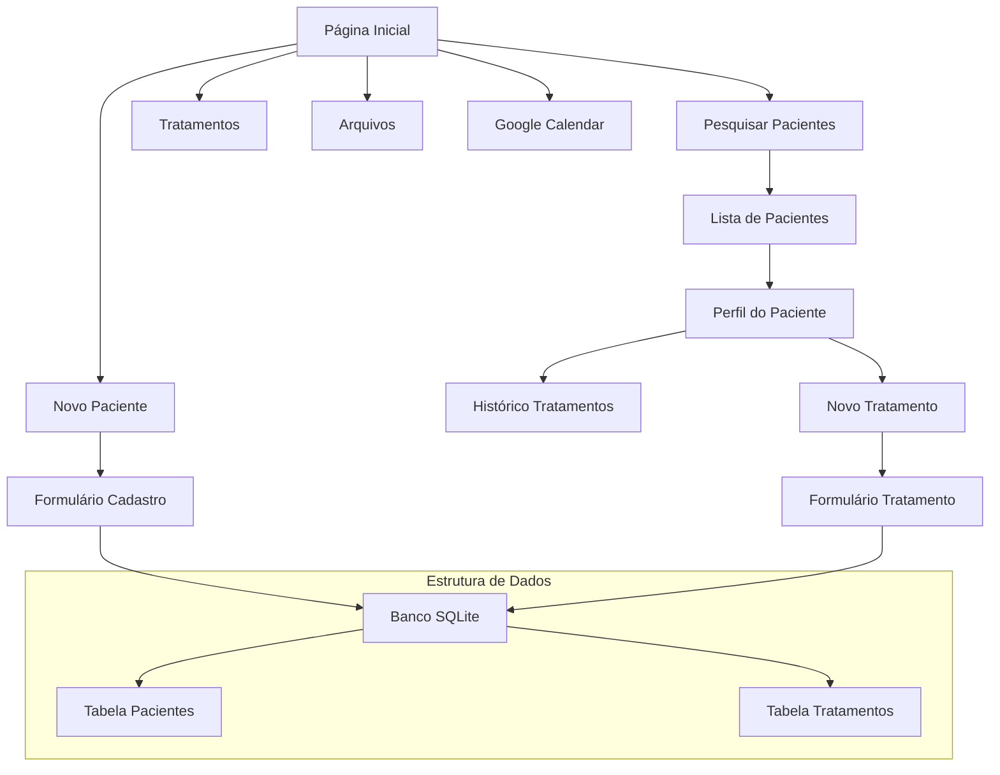
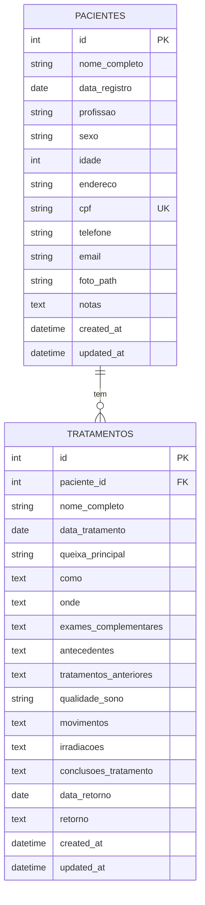

# Sistema de Gerenciamento de Pacientes de Osteopatia

## 📋 Visão Geral do Projeto

Sistema CRUD completo para gerenciamento de pacientes de osteopatia, desenvolvido em Flask com interface profissional e armazenamento local.

**Tecnologias Escolhidas:**
- **Backend:** Flask (Python)
- **Frontend:** HTML/CSS/JavaScript com templates Jinja2
- **Banco de Dados:** SQLite
- **Framework CSS:** Bootstrap 5 para interface profissional
- **Armazenamento de Imagens:** Pasta local com caminhos no banco

## 🏗️ Arquitetura do Sistema



## 📁 Estrutura de Arquivos

```
PatientsManagerKilo/
├── app.py                 # Aplicação Flask principal
├── config.py             # Configurações
├── requirements.txt      # Dependências Python
├── database/
│   ├── __init__.py
│   ├── models.py        # Modelos SQLAlchemy
│   └── database.db      # Banco SQLite (criado automaticamente)
├── static/
│   ├── css/
│   │   └── style.css    # Estilos customizados
│   ├── js/
│   │   └── main.js      # JavaScript customizado
│   └── uploads/         # Pasta para fotos dos pacientes
├── templates/
│   ├── base.html        # Template base
│   ├── index.html       # Página inicial
│   ├── novo_paciente.html
│   ├── pesquisar_pacientes.html
│   ├── perfil_paciente.html
│   ├── novo_tratamento.html
│   └── tratamentos.html
└── utils/
    ├── __init__.py
    └── helpers.py       # Funções auxiliares
```

## 🗄️ Estrutura do Banco de Dados



## 🎨 Interface do Usuário

**Página Inicial:**
- Layout limpo e profissional
- 5 botões grandes e intuitivos:
  - 👤 Novo Paciente
  - 🔍 Pesquisar Pacientes  
  - 💊 Tratamentos
  - 📁 Arquivos
  - 📅 Agenda Google (link externo)

**Formulários:**
- Validação client-side e server-side
- Campos obrigatórios claramente marcados
- Datepickers para datas
- Upload de fotos com preview
- Máscaras para CPF e telefone

## 🔧 Funcionalidades Principais

### 1. **Gestão de Pacientes**
- ✅ Cadastro completo com todos os campos solicitados
- ✅ ID auto-incrementado
- ✅ Data de registro automática
- ✅ Upload e armazenamento de fotos
- ✅ Validação de CPF único
- ✅ Pesquisa por nome ou CPF

### 2. **Gestão de Tratamentos**
- ✅ Vinculação automática ao paciente
- ✅ Preenchimento automático do nome
- ✅ Data de tratamento automática
- ✅ Todos os campos clínicos solicitados
- ✅ Histórico completo por paciente

### 3. **Segurança**
- ✅ Proteção contra SQL Injection (SQLAlchemy ORM)
- ✅ Validação de uploads de arquivo
- ✅ Sanitização de dados de entrada
- ✅ Validação de formulários

### 4. **Usabilidade**
- ✅ Interface responsiva (Bootstrap)
- ✅ Navegação intuitiva
- ✅ Feedback visual para ações
- ✅ Confirmações para exclusões

## 📋 Campos dos Formulários

### Cadastro de Pacientes
- **ID:** Auto-incrementado
- **Nome Completo:** Campo obrigatório
- **Data de Registro:** Automática (data atual)
- **Profissão:** Campo texto
- **Sexo:** Select (Masculino/Feminino/Outro)
- **Idade:** Campo numérico
- **Endereço:** Campo texto
- **CPF:** Campo com máscara e validação única
- **Telefone:** Campo com máscara
- **Email:** Campo com validação de formato
- **Foto:** Upload de arquivo (JPG, PNG)
- **Notas:** Campo texto livre

### Cadastro de Tratamentos
- **ID do Tratamento:** Auto-incrementado
- **Nome Completo:** Preenchido automaticamente
- **Data do Tratamento:** Automática (data atual)
- **Queixa Principal:** Campo texto
- **Como?:** Campo texto livre
- **Onde?:** Campo texto livre
- **Exames Complementares:** Campo texto livre
- **Antecedentes:** Campo texto livre
- **Tratamentos Anteriores:** Campo texto livre
- **Qualidade do Sono:** Campo texto
- **Movimentos:** Campo texto livre
- **Irradiações:** Campo texto livre
- **Conclusões e Tratamento:** Campo texto livre
- **Data de Retorno:** Datepicker
- **Retorno:** Campo texto livre

## 📋 Fluxo de Desenvolvimento

### **Fase 1: Configuração Base**
1. Configurar ambiente Flask
2. Criar estrutura de pastas
3. Configurar SQLite e modelos
4. Template base com Bootstrap

### **Fase 2: Funcionalidades Core**
1. Página inicial com navegação
2. Sistema de cadastro de pacientes
3. Upload e gerenciamento de fotos
4. Sistema de pesquisa

### **Fase 3: Sistema de Tratamentos**
1. Formulário de tratamentos
2. Histórico por paciente
3. Vinculação paciente-tratamento

### **Fase 4: Refinamentos**
1. Validações e segurança
2. Interface profissional
3. Testes e otimizações

## 🛠️ Tecnologias e Bibliotecas

**Python/Flask:**
- Flask
- SQLAlchemy
- Flask-WTF (formulários)
- Pillow (processamento de imagens)
- python-dateutil

**Frontend:**
- Bootstrap 5
- jQuery
- Font Awesome (ícones)
- Flatpickr (datepicker)

## 🔒 Considerações de Segurança

1. **Validação de Dados:** Validação rigorosa em formulários
2. **Upload Seguro:** Validação de tipos e tamanhos de arquivo
3. **SQL Injection:** Uso de ORM SQLAlchemy
4. **XSS Protection:** Escape automático do Jinja2
5. **CSRF Protection:** Flask-WTF tokens

## 📱 Responsividade

- Design mobile-first
- Interface adaptável para tablets e desktops
- Formulários otimizados para toque
- Navegação simplificada em dispositivos móveis

## 🚀 Como Executar

1. Instalar dependências:
```bash
pip install -r requirements.txt
```

2. Executar a aplicação:
```bash
python app.py
```

3. Acessar no navegador:
```
http://localhost:5000
```

## 📝 Notas de Desenvolvimento

- O sistema utiliza SQLite para armazenamento local
- As fotos são salvas na pasta `static/uploads/`
- Todos os formulários possuem validação client-side e server-side
- A interface é totalmente responsiva
- O código segue boas práticas de segurança

---

**Desenvolvido para profissionais de osteopatia - Interface profissional, segura e intuitiva.**